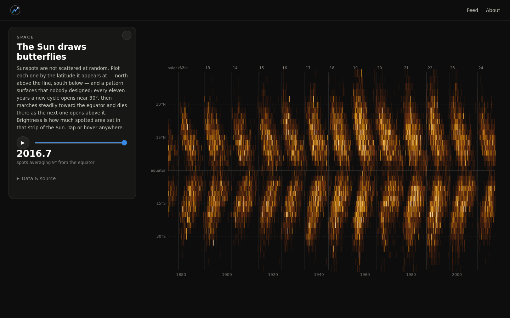
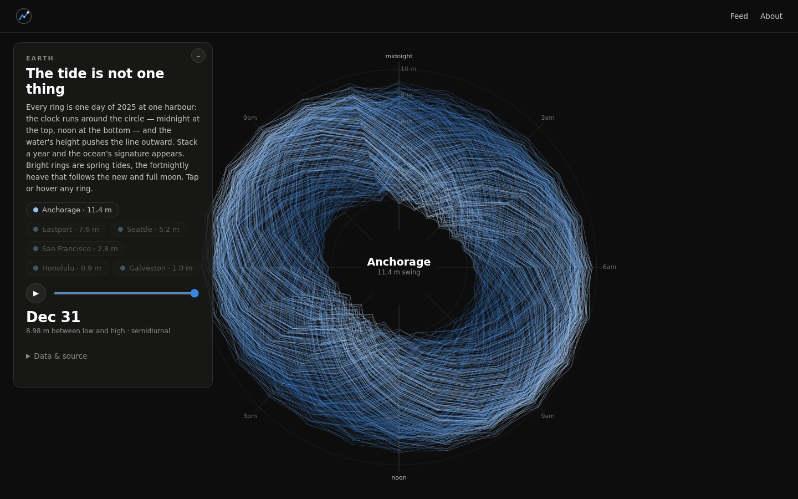
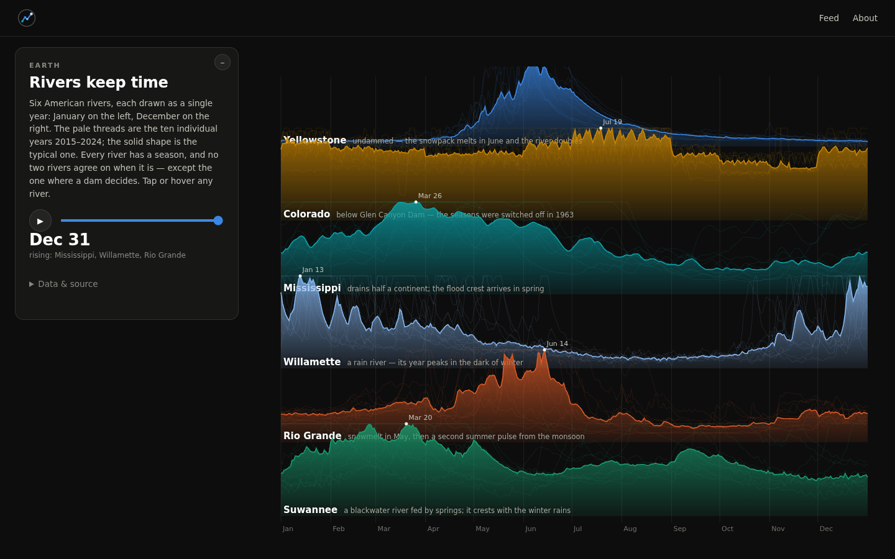
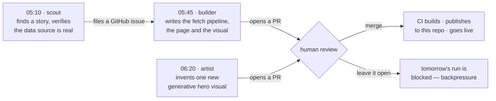

# charts

**A visual feed of the world's data — largely researched, built and shipped by autonomous agents on a nightly schedule.**

🔗 **[charts.thrain.ai](https://charts.thrain.ai)**

Every post is a real dataset rendered as something worth staring at: a year of tides at six harbours drawn as petals on a 24-hour clock, a century and a half of sunspots plotted by the latitude they appeared at, twenty-one years of American birth records laid on a calendar. No stock chart library, no dashboard templates — each post is hand-shaped canvas, SVG or WebGL over data pulled live from public sources.

<p align="center">
  
  
  
</p>

---

## The interesting part: it builds itself

Most of this site's growth happens while nobody is awake. Three scheduled agents run headless on a home server every morning, each with a written job spec, and their only output is a **pull request**. A human reviews and merges; merging is what deploys.



| Job | Runs | Does | Output |
|---|---|---|---|
| **scout** | 05:10 | Scans what's happening, translates it into a visual idea, then **proves the data exists** — fetches the actual URL, checks the schema and the licence before filing anything | GitHub issue |
| **builder** | 05:45 | Picks an issue and writes the whole post: data pipeline, page, visualisation, feed card, copy | Pull request |
| **artist** | 06:20 | Invents one new abstract hero visual for the homepage, in a family the pool doesn't have yet | Pull request |

The agents are given a written constitution (`AGENTS.md`) rather than a prompt, and they read it before every run.

## The guardrails are the engineering

Turning a model loose on a repo is easy. Making its output *trustworthy and non-repetitive over months* is the actual problem. What's in place:

- **Backpressure instead of a control panel.** A job refuses to run while its previous PR is still open. One unmerged PR per job, always — so the queue can't run away, and the merge button is the throttle. The gate fails closed: if GitHub can't be reached, the run is skipped rather than launching work nobody can review.
- **Honesty rules with teeth.** Every claim must be bounded to what the data actually covers, gaps get stated in the source line, and no post may imply completeness it doesn't have. When the feed drifted toward a rut of *"every X ever"* headlines, the rule grew a check the agent must run against the live feed before it may file another one.
- **Machine-checkable quality gates.** Colour palettes are validated against the dark surface for contrast, lightness monotonicity and colour-blind separation before a post can ship. Every visual must produce headless screenshots at 1440×900 *and* 390×844, and the spec says look at them.
- **Product boundaries.** Whole families of visual are declared off-limits because they belong to a sibling product, so the agents don't wander into someone else's territory.
- **Branch discipline enforced in the runner**, not just requested: never commit to main, always return the shared checkout to main, and a file lock serialises the three jobs so they can't collide.
- **Provider-agnostic by design.** The dispatcher resolves a model adapter from config; swapping vendors is a one-line change, and nothing else in the system knows which model ran.

Every one of those rules exists because something went wrong once. The backpressure gate, the palette validator, the screenshot sizes, the "don't kill processes by name pattern" rule — each is a postmortem turned into a constraint.

## Architecture

```
public data APIs                  home server (WSL2, systemd timers)
NOAA · USGS · NASA · SILSO ──┐    ├─ scout / builder / artist
UCDP · OWID · CDC · GBIF     │    └─ headless agent CLI → gh pull request
                             ▼
                    private source repo ──CI──► this repo (built output) ──► GitHub Pages
                                                          │
                                            Cloudflare Worker + KV (likes)
```

- **No framework.** Vite multi-page build, vanilla ES modules, deck.gl or d3 where a post needs them.
- **No database.** Data is refetched nightly by per-post pipelines and committed as compact JSON; the only server-side state anywhere is a like counter in a Cloudflare Worker.
- **No tracking**, no cookies, no accounts.
- **Runs for $0/month** — static hosting, free-tier Worker, and a home server that was already on.

## What's in this repo

This repository is the **built output** — it exists so GitHub Pages has something to serve, and it is force-replaced on every deploy. The source, the agent specs and the job runners live in a private repo.

## Receipts

As of 26 July 2026, six days after the first commit:

- **19 posts**, of which **5** were conceived, built and opened as PRs by the scheduled agents with no human involvement before review
- **10 generative hero visuals**, **3** of them agent-made
- **19 data pipelines** refreshed nightly against public sources
- The agents also file the ideas they *reject*, with reasons — a run that finds nothing worth building is allowed to ship nothing

---

*Built by [@baybailz](https://github.com/baybailz) · Thrain LLC*
